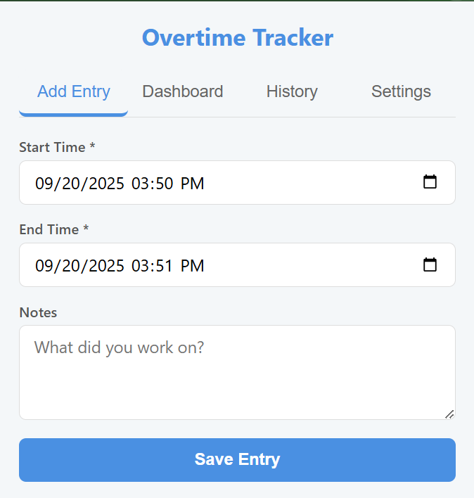

<<<<<<< HEAD
# Overtime Tracker ⏱️

A simple but powerful Chrome Extension to track your overtime hours, calculate converted business time, and visualize your work history. All data is stored locally and privately on your device.

<!-- Add a screenshot or GIF of the extension in action here! -->

---

## ✨ Features

*   **⏰ Log Overtime:** Easily add new overtime entries with start times, end times, and detailed notes.
*   **📈 Interactive Dashboard:** Visualize your daily overtime hours with a bar chart and see the breakdown of raw vs. converted hours with a pie chart.
*   **📜 Detailed History:** View all your entries grouped by month, with monthly and grand totals.
*   **✏️ Full CRUD Functionality:** Edit or delete any entry with a custom confirmation modal for safety.
*   **⚙️ Customizable Settings:** Set your own overtime conversion rate (e.g., 1.5 for time and a half).
*   **📅 Date Filtering:** Filter your history and dashboard by any date range to see specific periods.
*   **📄 CSV Export:** Export your filtered history to a CSV file for payroll or personal records.
*   **💾 100% Local Storage:** All your data is saved securely in your browser's IndexedDB. Nothing is sent to a server.

## 🚀 Installation (for Development)

To run this extension locally from the source code:

1.  **Clone the repository:**
    ```bash
    git clone https://github.com/M2BARH/overtime-tracker.git
    ```
2.  Open **Google Chrome** and navigate to `chrome://extensions`.
3.  Enable **"Developer mode"** using the toggle switch in the top-right corner.
4.  Click the **"Load unpacked"** button.
5.  Select the folder where you cloned the repository.

The Overtime Tracker icon should now appear in your extensions toolbar!

## 🛠️ How to Use

1.  Click the extension icon in your Chrome toolbar to open the popup.
2.  Use the **Add Entry** tab to log a new overtime session.
3.  Switch to the **Dashboard** tab to see your charts.
4.  Visit the **History** tab to view, filter, edit, or delete entries.
5.  Go to the **Settings** tab to configure your overtime conversion rate.

## 💻 Technology Stack

*   **Frontend:** HTML5, CSS3 (Flexbox), Vanilla JavaScript (ES6+)
*   **Charting:** [Chart.js](https://www.chartjs.org/)
*   **Database:** [IndexedDB](https://developer.mozilla.org/en-US/docs/Web/API/IndexedDB_API) (via simple async wrappers)
*   **Packaging:** Chrome Extension Manifest V3

## 📄 License

This project is licensed under the MIT License - see the [LICENSE](LICENSE) file for details.